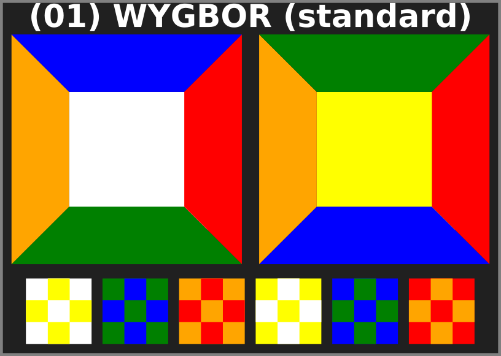
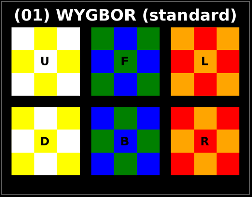
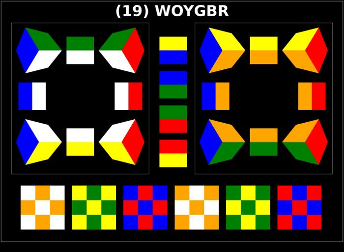
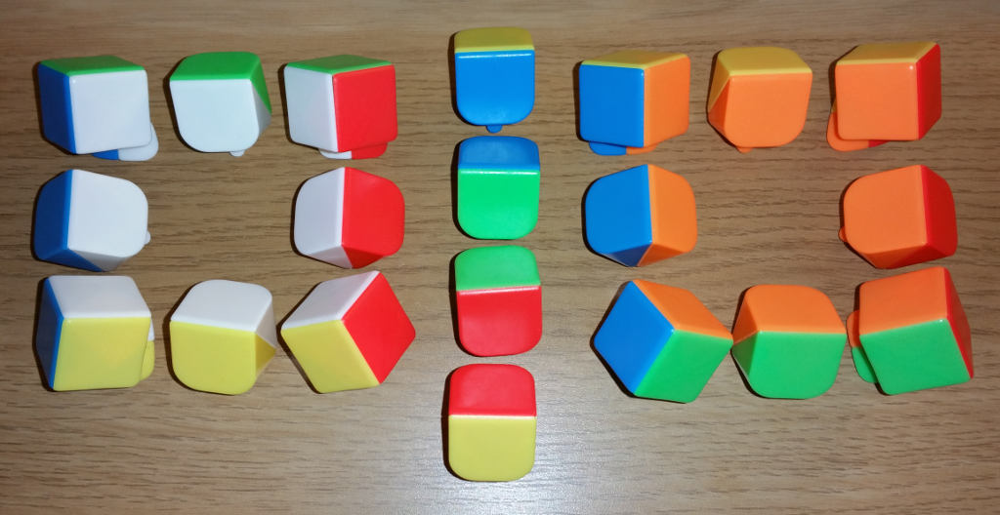
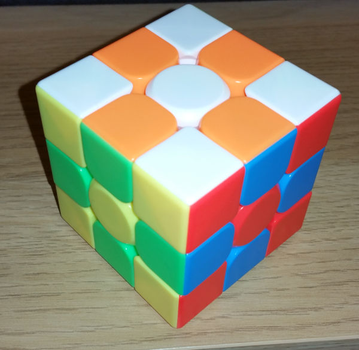
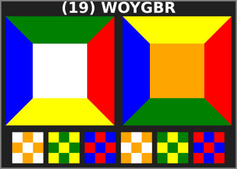
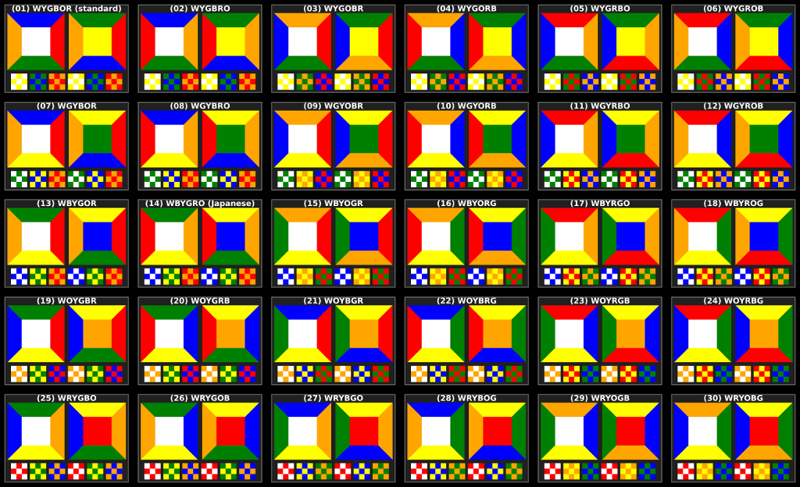

Introduction
============

This is a tool to generate all the unique color schemes for the stickerless cubes using the standard colors (white, red, green, orange, blue, yellow).

Most of the common stickerless cubes have corners and edges which can be taken apart and reassembled in different ways to produce another color scheme.

The output of this tool are images which shows how the edges and corners can be reassambled and the resulted checkerboard patterns.

The id of the scheme is the order: up, down, front, back, left, right. 

Example:
--------
The standard blue-orange-yellow scheme:  

The same scheme displayed in a simplified form:  

In the simplified form the edges are represented by the intersection of two colors while the corners are represented by the intersection of three colors.

The checkerboard-only images are also generated:

Another example with real photo
-------------------------------

The "WOYBGR" scheme:

The WOYBGR scheme construction with a Meilong 3x3 cube:

The checkerboard pattern of the same (WOYBGR) scheme:

The simplified form of the WOYGBR scheme:

The simplified form gives enough information about the relationships between faces' colors and about the colors of the pieces.

The output:
==========

The resulting images are available by clicking the image below:  

License:
=======
Public domain or CC0
